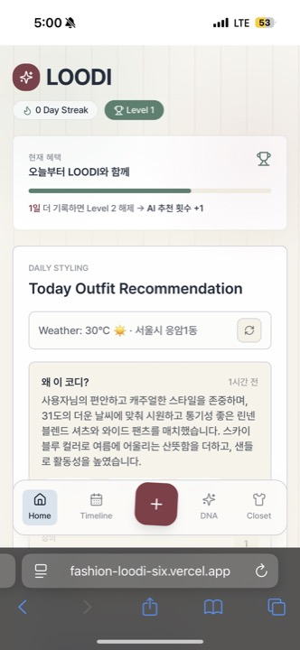
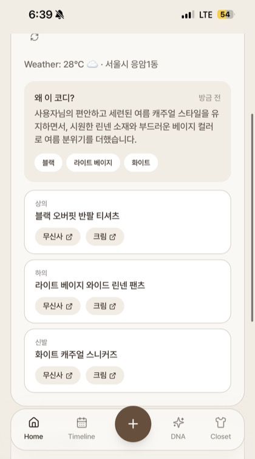
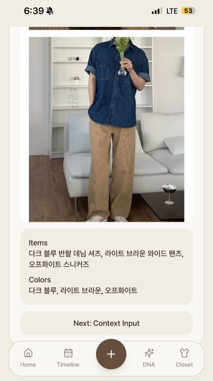
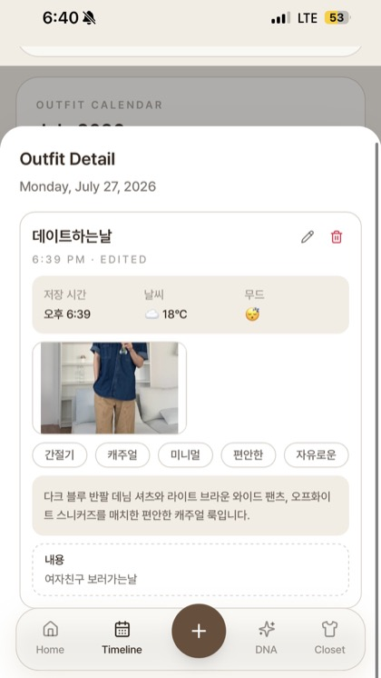
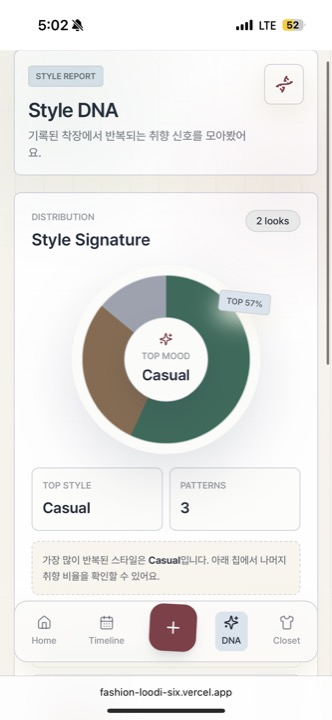
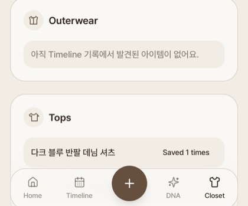

# FASHION-LOODI

> 매일의 착장을 AI로 분석하고, 기록이 쌓일수록 나만의 스타일 취향을 정리해 주는 패션 다이어리 웹앱

**LOODI**는 사용자가 업로드한 착장 사진을 기반으로 의류 아이템, 컬러, 스타일, 무드를 자동 분석하고 기록하는 모바일 중심 웹앱입니다. 단순한 코디 기록을 넘어서, 누적된 데이터를 바탕으로 Style DNA와 날씨 기반 코디 추천까지 제공하는 개인화 패션 기록 서비스입니다.

## Project Summary

| 항목 | 내용 |
| --- | --- |
| 프로젝트 유형 | AI 패션 다이어리 웹앱 |
| 핵심 가치 | 착장 기록 자동화, 개인 스타일 분석, 상황 기반 코디 추천 |
| 주요 사용자 흐름 | 로그인 → 착장 사진 기록 → AI 분석 → 타임라인 저장 → Style DNA/추천 확인 |
| 구현 범위 | 인증, 온보딩, AI 분석 API, 코디 추천 API, 다이어리, 타임라인, 옷장, Style DNA |

## Tech Stack

| Category | Tech |
| --- | --- |
| Language | TypeScript |
| Framework | Next.js, React |
| Styling | Tailwind CSS, shadcn/ui 스타일 컴포넌트 |
| Animation | Motion |
| Authentication | Supabase Auth |
| AI | Google Gemini API |
| Storage | LocalStorage, SessionStorage, Supabase Auth metadata |
| Deployment | Vercel |

## Key Features

| Feature | Description |
| --- | --- |
| AI 착장 분석 | 사진 속 의류 아이템, 색상, 스타일, 계절감, 무드를 자동 태깅합니다. |
| 오늘의 코디 추천 | 날씨, 최근 기록, 선호 스타일을 바탕으로 오늘 입기 좋은 코디를 추천합니다. |
| 패션 다이어리 | 착장 사진, 날씨, 무드, 태그, 메모를 날짜별 기록으로 저장합니다. |
| Style DNA | 누적 기록을 기반으로 사용자의 스타일 분포와 취향 패턴을 시각화합니다. |
| Closet | 기록에서 감지된 아이템을 카테고리별로 모아 옷장처럼 확인합니다. |
| Auth & Access Control | Supabase 기반 Google/아이디 로그인을 지원하고, 허용 계정만 접근하도록 제한합니다. |

## Screens

### Home & Daily Recommendation

| Home | Recommendation Detail |
| --- | --- |
|  |  |

홈 화면에서는 기록 스트릭, 레벨, 현재 혜택을 보여주고, 날씨와 사용자의 최근 스타일 기록을 바탕으로 오늘의 코디를 추천합니다. 추천 결과는 이유, 컬러 팔레트, 상의/하의/신발 등 아이템 단위로 분리되어 제공됩니다.

### AI Outfit Analysis

<p>
  
</p>

착장 사진을 업로드하면 Gemini API가 이미지에서 보이는 의류 아이템과 색상을 분석합니다. 분석 결과는 저장 전 사용자가 확인할 수 있도록 아이템 목록과 컬러 정보로 정리됩니다.

```json
{
  "items": [
    { "category": "상의", "name": "다크 블루 반팔 데님 셔츠" },
    { "category": "하의", "name": "라이트 브라운 와이드 팬츠" },
    { "category": "신발", "name": "오프화이트 스니커즈" }
  ],
  "colors": ["다크 블루", "라이트 브라운", "오프화이트"],
  "style": ["캐주얼"],
  "season": "여름",
  "mood": ["편안한"]
}
```

### Timeline Detail

<p>
  
</p>

저장된 착장은 타임라인에서 날짜별로 확인할 수 있습니다. 사진, 날씨, 무드, 태그, AI 분석 문장, 직접 작성한 메모를 함께 관리할 수 있어 단순 이미지 저장보다 풍부한 코디 기록을 남길 수 있습니다.

### Style DNA

<p>
  
</p>

기록이 쌓이면 사용자가 자주 입는 스타일을 분석해 Style DNA로 시각화합니다. Casual, Vintage, Minimal 같은 스타일 비율을 계산하고, 사용자가 어떤 무드와 실루엣을 선호하는지 한눈에 볼 수 있게 구성했습니다.

### Closet

<p>
  
</p>

AI가 감지한 아이템은 카테고리별로 정리됩니다. 상의, 하의, 아우터, 신발 등 반복적으로 저장된 아이템을 모아 보여주어 사용자의 실제 착장 데이터 기반 옷장 역할을 합니다.

## Implementation Highlights

### AI 응답 안정화

AI 모델 응답은 항상 일정하지 않기 때문에, 서버 API에서 응답을 그대로 전달하지 않고 파싱과 정규화를 거쳐 프론트엔드에 반환합니다.

- 요청 body와 이미지 MIME type 검증
- 모델 응답에서 JSON 객체 추출
- `items`, `colors`, `style`, `season`, `mood`, `description` 구조로 정규화
- 허용되지 않은 카테고리와 빈 값 제거
- 누락된 값은 기본값으로 보정
- 503, 429, quota 계열 오류에 retry/backoff 적용
- 특정 Gemini 모델 실패 시 다른 모델로 fallback

### 인증과 접근 제어

Supabase Auth를 사용해 Google 로그인과 아이디/비밀번호 로그인을 구현했습니다. API 요청에는 Supabase access token을 포함하고, 서버에서는 허용된 이메일인지 검증한 뒤 AI API를 실행합니다.

### 기록 기반 개인화

착장 기록은 단순 저장에 그치지 않고 추천과 분석의 입력 데이터로 재사용됩니다. 최근 기록, 감지된 아이템, 컬러, 스타일 태그를 바탕으로 홈 추천과 Style DNA가 동적으로 구성됩니다.

## Folder Structure

```txt
app/
  api/
    analyze-outfit/       # Gemini 기반 착장 분석 API
    recommend-outfit/     # 개인화 코디 추천 API
    contact-chat/         # LOODI AI 문의 챗봇 API
  onboarding/             # 온보딩, 사진 업로드, AI 분석 플로우
  (main)/                 # Home, Record, Timeline, DNA, Closet
components/
  auth/                   # 접근 제어 컴포넌트
  blocks/                 # 주요 화면 블록
  navigation/             # 하단 네비게이션
lib/
  access-control.ts       # 허용 이메일 기반 접근 제어
  auth-identifier.ts      # 아이디를 Supabase Auth 이메일 형식으로 변환
  authenticated-fetch.ts  # 로그인 토큰 포함 API 요청
  onboarding-analysis-images.ts
  outfit-diary.ts
```

## Local Run

```bash
npm install
npm run dev
```

```txt
http://127.0.0.1:3000
```

