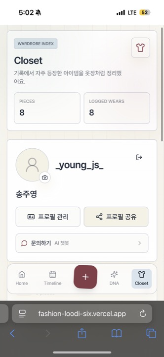
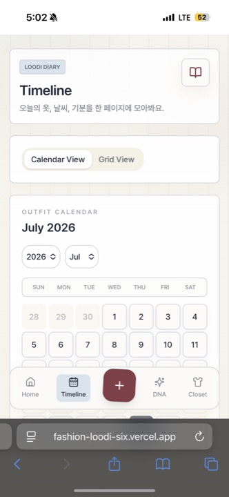
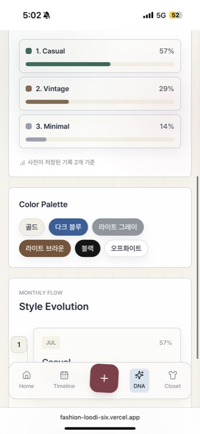
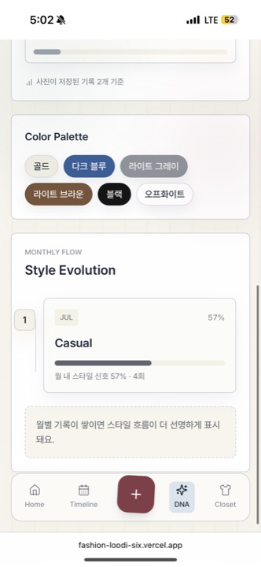
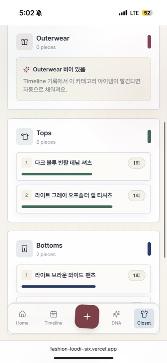

# FASHION-LOODI

> Your Style, Recorded.

**LOODI**는 매일의 착장을 사진으로 기록하고, AI 분석 결과를 바탕으로 오늘의 코디 추천, Style DNA, 아이템 옷장, 프로필 공유까지 이어지는 모바일 중심 패션 다이어리 웹앱입니다.

<p align="center">
  
  &nbsp;&nbsp;
  
  &nbsp;&nbsp;
  
</p>

## Overview

| Category | Description |
| --- | --- |
| Project | AI 기반 패션 다이어리 웹앱 |
| Goal | 착장 기록을 자동 분석하고, 누적 데이터로 개인 취향과 아이템 사용 흐름을 시각화 |
| User Flow | 로그인/회원가입 -> 프로필 설정 -> 착장 사진 업로드 -> AI 분석 -> 타임라인 저장 -> 추천/Style DNA/Closet 확인 |
| Scope | 인증, 프로필, 온보딩, AI 분석 API, 코디 추천 API, 타임라인, Style DNA, 옷장, 프로필 공유 |

## Tech Stack

| Area | Stack |
| --- | --- |
| Language | TypeScript |
| Frontend | Next.js, React |
| Styling | Tailwind CSS, shadcn/ui 스타일 컴포넌트 |
| Animation | Motion |
| Auth | Supabase Auth |
| AI | Google Gemini API |
| State & Storage | React State, LocalStorage, SessionStorage, Supabase Auth Metadata |

## Core Features

| Feature | What it does |
| --- | --- |
| Auth & Profile | 커머스 앱 스타일의 로그인/회원가입, 닉네임/이름/생년월일/성별 설정, 프로필 사진 저장 |
| Daily Streak | 오늘 기록이 있어야 유지되는 일 단위 streak와 기록 날짜 기반 레벨 표시 |
| AI Outfit Analysis | 착장 사진에서 아이템, 컬러, 스타일, 계절감, 무드를 자동 추출 |
| Daily Recommendation | 날씨와 최근 기록을 기반으로 오늘 입기 좋은 코디와 쇼핑 검색 링크 추천 |
| Outfit Timeline | 사진, 날씨, 무드, 태그, 메모를 날짜별 착장 기록으로 저장 |
| Style DNA | 누적 착장 데이터를 기반으로 스타일 분포, 컬러 팔레트, 월별 스타일 흐름 시각화 |
| Closet | 기록에서 감지된 의류 아이템을 카테고리별로 자동 정리 |
| Profile Share | 저장된 룩 일부를 Grid View 형태로 미리 보고 네이티브 공유/링크 복사 |
| Access Control | Supabase Auth 기반 로그인과 허용 계정 검증 |

## Feature Walkthrough

### 1. Home & Daily Recommendation

<table>
  <tr>
    <td width="50%" align="center">
      
    </td>
    <td width="50%" align="center">
      
    </td>
  </tr>
  <tr>
    <td>
      홈 화면은 일 단위 Day Streak, 기록 날짜 기반 Level, 오늘 날씨, AI 추천 이유를 한 화면에서 보여줍니다.
    </td>
    <td>
      추천 결과는 상의, 하의, 신발 등 착장 단위로 구성되고 무신사/KREAM 검색 링크로 바로 이어집니다.
    </td>
  </tr>
</table>

### 2. Timeline Diary

<table>
  <tr>
    <td width="40%" align="center">
      
    </td>
    <td width="60%">
      <b>착장을 단순 사진이 아니라 날짜와 맥락으로 저장합니다.</b><br /><br />
      타임라인은 Calendar View와 Grid View를 제공하며, 날짜별 착장 기록을 사진, 날씨, 무드, 태그, AI 분석 문장, 직접 작성한 메모와 함께 관리할 수 있습니다.
    </td>
  </tr>
</table>

### 3. AI Outfit Analysis

<table>
  <tr>
    <td width="40%" align="center">
      
    </td>
    <td width="60%">
      <b>사진 한 장으로 착장 정보를 구조화합니다.</b><br /><br />
      Gemini API가 이미지 속 의류를 분석하고, 서버에서 결과를 일정한 구조로 정규화합니다. 저장된 분석 결과는 추천, Style DNA, Closet 통계에 재사용됩니다.
      <br /><br />
      <code>items</code>, <code>colors</code>, <code>style</code>, <code>season</code>, <code>mood</code>, <code>description</code> 형태로 정리해 프론트엔드가 항상 같은 데이터 구조를 다룰 수 있게 했습니다.
    </td>
  </tr>
</table>

```json
{
  "items": [
    { "category": "상의", "name": "다크 블루 반팔 데님 셔츠" },
    { "category": "하의", "name": "라이트 브라운 와이드 팬츠" },
    { "category": "신발", "name": "다크 브라운 레더 샌들" }
  ],
  "colors": ["다크 블루", "라이트 그레이", "라이트 브라운", "블랙"],
  "style": ["Casual", "Vintage", "Minimal"],
  "season": "여름",
  "mood": ["편안한", "캐주얼"]
}
```

### 4. Style DNA

<table>
  <tr>
    <td width="33%" align="center">
      
    </td>
    <td width="33%" align="center">
      
    </td>
    <td width="33%" align="center">
      
    </td>
  </tr>
  <tr>
    <td colspan="3">
      <b>기록이 쌓일수록 취향이 데이터로 보입니다.</b><br /><br />
      누적된 착장 기록에서 스타일 태그와 컬러를 집계해 Casual, Vintage, Minimal 같은 스타일 비율과 자주 등장한 컬러 팔레트, 월별 스타일 흐름을 시각화합니다.
    </td>
  </tr>
</table>

### 5. Closet & Profile

<table>
  <tr>
    <td width="50%" align="center">
      
    </td>
    <td width="50%" align="center">
      
    </td>
  </tr>
  <tr>
    <td>
      Closet 상단에서는 닉네임, 이름, 프로필 사진, 프로필 관리, 프로필 공유, 문의하기 진입을 제공합니다.
    </td>
    <td>
      타임라인 기록에서 발견된 상의, 하의, 아우터, 신발 등을 카테고리별로 모아 보여주고 반복 등장 횟수를 표시합니다.
    </td>
  </tr>
</table>

## Technical Focus

### AI Response Normalization

AI 응답은 매번 완전히 동일하지 않기 때문에, API Route에서 응답을 바로 전달하지 않고 검증, 파싱, 정규화를 거친 뒤 프론트엔드에 반환하도록 구성했습니다.

- 요청 body와 이미지 MIME type 검증
- Gemini 응답에서 JSON 객체 추출
- 누락 필드 기본값 보정
- 허용 카테고리 외 값 제거
- 빈 배열과 빈 문자열 정리
- 프론트엔드가 사용하는 고정 응답 구조로 반환

### Record-Based Personalization

착장 기록은 저장에서 끝나지 않고 추천과 분석의 입력 데이터로 재사용됩니다. 최근 기록, 감지된 아이템, 컬러, 스타일 태그를 바탕으로 홈 추천, Style DNA, Closet이 동적으로 구성됩니다.

- Day Streak은 오늘 기록이 있어야 유지되는 일 단위 계산
- 레벨은 전체 기록 수가 아니라 기록한 날짜 수 기준으로 산정
- 같은 날 여러 번 기록해도 streak와 레벨 날짜 수는 1일로 계산
- 프로필 사진과 다이어리 기록은 사용자별 LocalStorage key로 분리 저장

### Reliability Handling

외부 AI API 호출 중 일시적인 실패가 발생할 수 있어 서버 레벨에서 실패율을 줄이는 방어 로직을 두었습니다.

- 429, 503, quota 계열 오류에 retry/backoff 적용
- 특정 모델 실패 시 다른 Gemini 모델로 fallback
- API 실패 시 사용자에게 보여줄 수 있는 안정적인 오류 메시지 반환
- 인증된 사용자와 허용 계정만 AI API를 호출하도록 제한

## Project Structure

```txt
app/
  api/
    analyze-outfit/       # Gemini 기반 착장 분석 API
    recommend-outfit/     # 개인화 코디 추천 API
    contact-chat/         # LOODI AI 문의 챗봇 API
  onboarding/             # 온보딩, 사진 업로드, AI 분석 플로우
  profile/setup/          # 닉네임, 이름, 개인정보 설정
  (main)/                 # Home, Record, Timeline, DNA, Closet
components/
  auth/                   # 접근 제어 컴포넌트
  blocks/                 # 주요 화면 블록
  navigation/             # 하단 네비게이션
lib/
  access-control.ts       # 허용 이메일 기반 접근 제어
  auth-identifier.ts      # 아이디를 Supabase Auth 이메일 형식으로 변환
  authenticated-fetch.ts  # 로그인 토큰 포함 API 요청
  onboarding-analysis-images.ts
  outfit-diary.ts         # 다이어리 저장, streak, level 계산
```

## Local Run

```bash
npm install
npm run dev
```

```txt
http://127.0.0.1:3000
```
